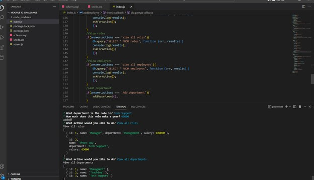

# Employee-Manager-App---UNC---Zac-Ellis 

## Table of contents
1.) [Description](#description)
2.) [Installation Instructions](#install)
3.) [Usage](#usage)
4.) [Contributers](#contributers)
5.) [Testing Instructions](#testing)
6.) [Contact Information](#contact)
7.) [Screen Shots and Link to demo](#screenShots)

## Description
A command line application to help manage an employee database. 

## Installation Instructions
Install npm packages and mysql. 

## Usage
Run index.js file and select from prompted options to view or add to database tables.  

## Contributers
Zac Ellis

## Testing Instructions
Run application and answer prompts. 
Data base should reset if not seeded at the start.  

## Contact Information
GitHub: zellis117 , Email: zacellis117@gmail.com

## Screen Shots
Link to demonstration video: https://drive.google.com/file/d/18nbV7nTem45Um9NlvbsuRx57-Tg-Oiid/view 

